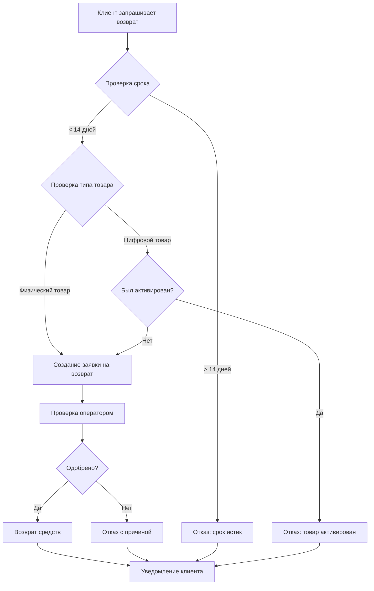
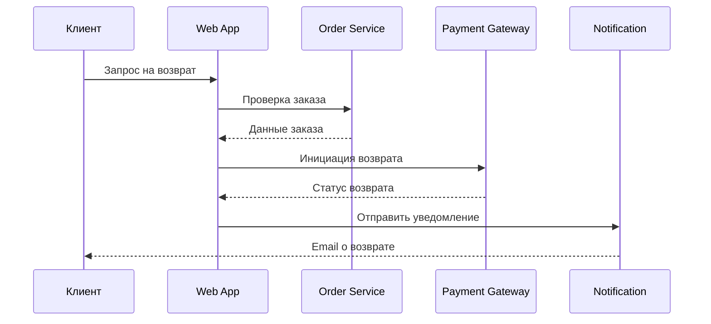

# Процесс возврата средств

## Диаграмма процесса (Mermaid)



## Диаграмма последовательности



## Важная информация

!!! note "Примечание"
    Возврат средств обрабатывается в течение 5 рабочих дней после одобрения заявки.

!!! warning "Внимание"
    Цифровые товары после активации не подлежат возврату согласно политике компании.

!!! danger "Критично"
    При возврате товаров по акции пересчитываются все применённые скидки.

!!! tip "Совет"
    Для ускорения процесса возврата прикрепите фото товара и чек к заявке.

!!! info "Информация"
    Среднее время обработки возврата: 2-3 рабочих дня.

!!! success "Успех"
    После одобрения возврата средства поступят на карту в течение 3-5 дней.

!!! example "Пример"
    Клиент купил товар за 5000 руб со скидкой 20%. При возврате будет возвращено 4000 руб.

!!! quote "Цитата из политики"
    "Мы стремимся обеспечить максимально быстрый и удобный процесс возврата для наших клиентов."

## Сворачиваемые блоки

??? note "Детали реализации (нажмите, чтобы развернуть)"
    Здесь можно разместить техническую информацию, которая не нужна всем читателям:

    - API endpoint: `POST /api/v1/refunds`
    - Timeout: 30 секунд
    - Retry policy: 3 попытки с экспоненциальной задержкой

???+ warning "Известные ограничения (развёрнуто по умолчанию)"
    - Максимальная сумма автоматического возврата: 50 000 руб
    - Возвраты свыше требуют ручного одобрения
    - Лимит: 3 возврата в месяц на одного клиента

## Draw.io диаграммы

Для использования Draw.io диаграмм:

1. Создайте файл `.drawio` или `.drawio.svg` в папке `assets/`
2. Вставьте в документ:

```markdown

```

Диаграммы Draw.io автоматически рендерятся на странице.
