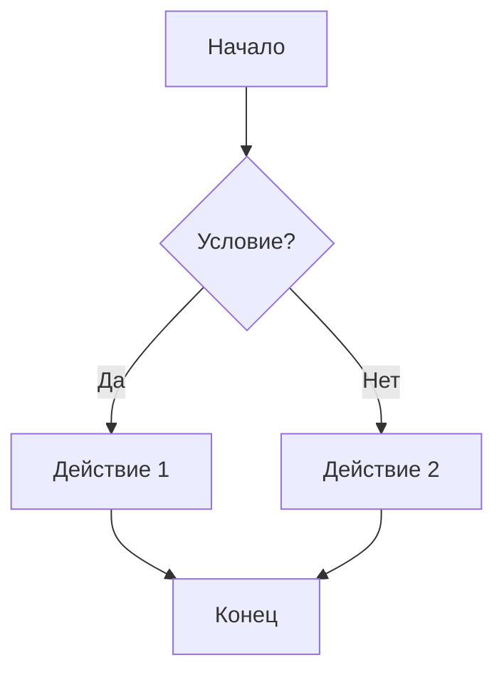

# Процесс: F001 Функция

## Диаграмма процесса

## Шаги процесса

1. **Шаг 1** — описание
2. **Шаг 2** — описание
3. **Шаг 3** — описание

## Участники

| Роль | Ответственность |
|------|-----------------|
| Пользователь | Инициирует процесс |
| Система | Обрабатывает запрос |

## Исключения

| Ситуация | Действие |
|----------|----------|
| Ошибка валидации | Показать сообщение об ошибке |
| Таймаут | Повторить запрос |
